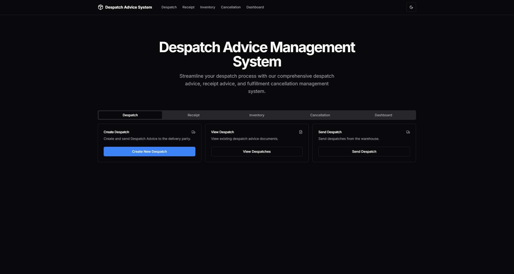

# Despatch Advice System

A comprehensive Next.js application for managing despatch advice, receipt advice, and fulfillment cancellation processes. This system provides a complete solution for inventory management, order processing, and despatch tracking.



## Features

- **Despatch Management**
  - Create despatch advice documents
  - View existing despatch documents
  - Send despatches from warehouse

- **Receipt Management**
  - View receipt advice documents

- **Inventory Management**
  - Product management (add, view, delete)
  - Stock management
  - Real-time inventory statistics

- **Cancellation Management**
  - Create despatch cancellations
  - View cancellation documents

- **Dashboard**
  - Real-time inventory statistics
  - Recent despatch activities
  - Stock overview

## Technologies Used

- **Frontend**
  - Next.js 14+ (App Router)
  - React 18+
  - TypeScript
  - Tailwind CSS
  - shadcn/ui components
  - Lucide React icons

- **Features**
  - Server Components
  - Client Components
  - API Service Layer
  - Form Validation
  - Dark/Light Mode
  - Responsive Design

## Installation

### Prerequisites

- Node.js 18.17.0 or later
- npm or yarn

### Setup

1. Clone the repository:
   ```bash
   git clone git@github.com:kaisequeira/SENG2021Frontend.git
